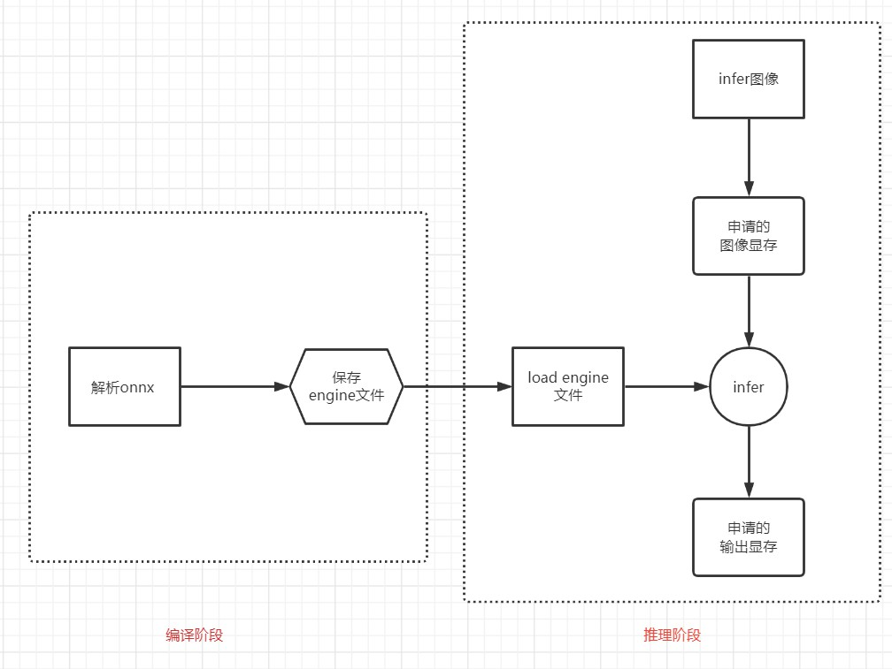

# 记录第一阶段实现过程

- 一步一步理解shouxieAI团队的想法

- yolov5 onnx的导出使用 [tensorRT_Pto](https://github.com/shouxieai/tensorRT_Pro)中的生成脚本。

## 1 标准TRT推理流程

一般地，我们串行写出的算是个demo，但是若想项目中使用，那就需要用到封装/多线程/内存复用等高级思想。

第一阶段，我们先完成封装和多线程管理job。

## 封装
对于编译阶段和推理阶段可以分别创建trt_build 和 trt_infer两个类。 这里还是用到IMPL的思想，将实现放在cpp中，头文件只放接口。

