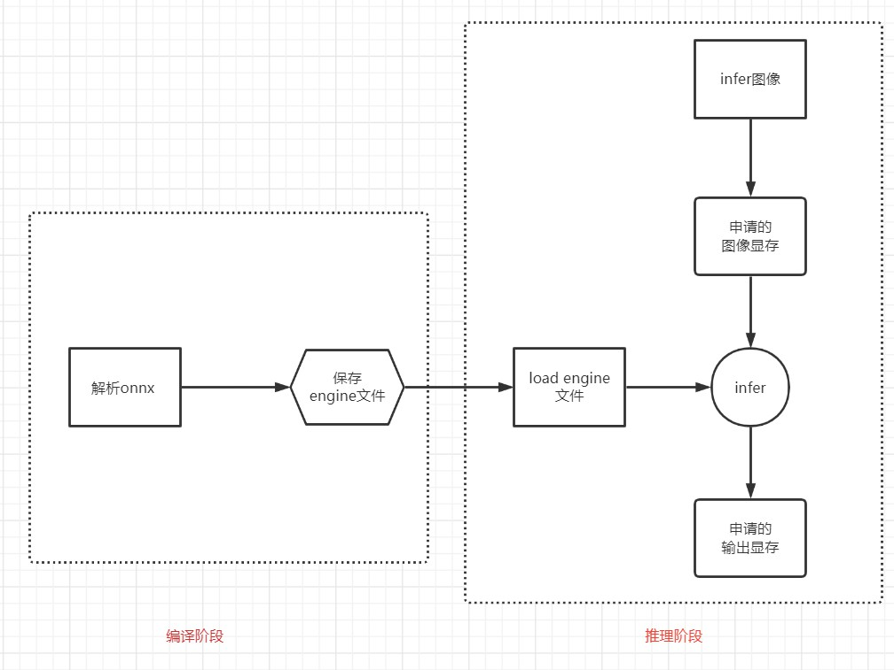
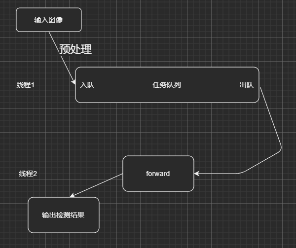

# 记录第一阶段实现思想

- 一步一步理解shouxieAI团队的想法

- yolov5 onnx的导出使用 [tensorRT_Pto](https://github.com/shouxieai/tensorRT_Pro)中的生成脚本。

## 标准TRT推理流程

一般地，我们串行写出的算是个demo，但是若想项目中使用，那就需要用到封装/多线程（job管理）/内存复用等高级思想。

第一阶段，我们先完成封装和多线程管理job。

## 封装

对于编译阶段和推理阶段可以分别创建trt_build 和 trt_infer两个类。 这里还是用到IMPL的思想，将实现放在cpp中，头文件只放接口。

在build中，我们只关注解析onnx，保存engine的流程。这个流程很标准，注意我们这里全部使用智能指针。

在infer中，我们们需要关注engine文件的解析，创建context，以及forward。

这些都是用对应的类，封装起来，只留一个接口。

## job管理

job的管理我的理解就是：一个线程做图像与处理，并放入队列；另一个线程从队列中拿处理好的数据，进行推理。

因为每个任务，比如yolov3 yolov5 yolox，他们的预处理不一样，因此  <mark>预处理</mark> 函数必然为 纯虚函数， 同理 woker函数是执行每个任务的forward和decode的，所以<mark>woker函数</mark>也必须为纯虚函数。

因此对于基类 <mark>JobManager </mark>（trt_pro中即为 <mark>InferController</mark>），它的功能就是需要完成创建新线程来执行worker，以及对job队列的管理，因为涉及到多线程对同一个队列的push和pop，因此就使用到了<mark>锁、条件变量等</mark>的概念

每个任务继承JobManager类，实现自己的worker和与处理函数即可。woker函数需要解析engine文件，然后从队列pop到数据，执行forward和decode得到结果。

## 数据（tensor）管理

预处理之后，数据需要存放到gpu上，因此在job队列中流传的应该就是Gpu上的数据，但是这个数据我们需要知道维度，数据起始地址等，所以我们使用一个trt_tensor类来封装。

第一阶段 我们先不关注Tensor的非常细节的内存复用等操作，我们就只实现cudamalloc/cudafrree操作，记录其维度信息等。因此我们在预处理函数中，我们要cudaMemcpyHostToDevice，将处理后的图拷贝到显存， 在woker中 forward之后，我们再cudaMemcpyDeviceToHost，拿到最后结果。

而在第二阶段，我们就需要将这个操作全部封装到Tensor类中。
