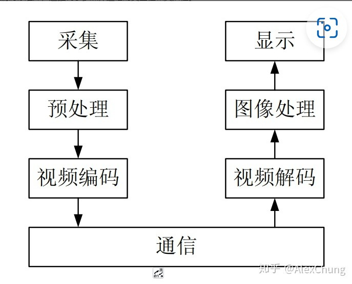
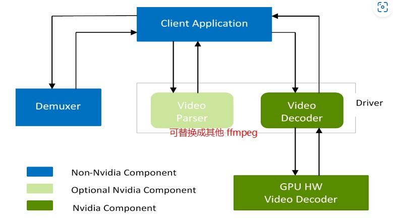

# 视频编解码

* 通俗理解 编码与解码
  
  * [视频的编解码格式 - 知乎 (zhihu.com)](https://zhuanlan.zhihu.com/p/143720720)
  
  * **所谓编码就是把要传递的信息按照一定的规则进行组织，所谓解码就是把收到的信息按照一定的规则进行解析，并且这个规则必须是编码者和解码者事先都知道或约定好的**
  
  * 视频编码：比如 H264. H265 编码中实现了压缩，去除视频数据中的冗余信息。 解码则相反，是恢复原始数据，
    
    

*    封装格式：
  
  * 视频封装格式就是将已经编码处理的 视频数据  音频数据以及字幕数据按照一定的方式放到一个文件中.
  
  * 容器--封装
  
  * 严格意义上说，我们通常所说的是视频格式，指的就是视频封装格式
  
  * 编码格式与封装格式的名称有时是一致的，例如MPEG、WMV、DivX、XviD、RM、RMVB等格式，既是编码格式，也是封装格式；有时却不一致，例如MKV是一种能容纳多种不同类型编码的视频、音频及字幕流的“万能”视频封装格式，同样以mkv为扩展名的视频文件，可能封装了不同编码格式的视频数据

## 编码-encoder

## 解码-decoder
* 大白话：把视频文件-解码成内存中的数据，用于后面处理。
* 官方tutorial https://docs.nvidia.com/video-technologies/video-codec-sdk/nvdec-video-decoder-api-prog-guide/index.html
* NVDEC 解码引擎。  通过  NVDECODE API 来访问NVDEC的视频解码功能
* NVDEC 从视频流中解码出YUV视频帧，这些帧可以直接用cuda来处理。
### pipeline
包括三个部分： Demuxer, Video Parser, and Video Decoder。这三个部分相互独立，可以单独使用。
NVDECODE API 提供了 NVIDIA video parser and NVIDIA video decoder. 另外Video Parser 可以替换其他的视频解析软件（FFMPEG）


使用NVDECODEAPI的步骤:
1. Create a CUDA context.
2. Query the decode capabilities of the hardware decoder. 查询硬件解码能力
3. Create the decoder instance(s). 创建解码器实例
4. De-Mux the content (like .mp4). This can be done using third party software like FFMPEG. 读取文件，使用第三方实现，得到视频流。
5. Parse the video bitstream using parser provided by NVDECODE API or third-party parser such as FFmpeg 解析视频流
6. Kick off the Decoding using NVDECODE API. 开始解码
7. Obtain the decoded YUV for further processing 拿到YUV后，进一步处理
8. Query the status of the decoded frame 查询解码帧的状态
9. 根据8的状态，进一步后处理：inferencing, postprocessing
10. If the application needs to display the output：  输出：
    * Convert decoded YUV surface to RGBA.
    * Map RGBA surface to DirectX or OpenGL texture.
    * Draw texture to screen.
11. Destroy the decoder instance(s) after the completion of decoding process 析构
    * cuvidDestroyVideoParser
    * cuvidDestroyDecoder
12. Destroy the CUDA context. 

```c++
/*代码为API中sample的AppDec*/
//1
CUcontext cuContext = NULL;
createCudaContext(&cuContext, iGpu, 0);

//3 
FFmpegDemuxer demuxer(szInFilePath);

//3 
NvDecoder dec(cuContext, false, FFmpeg2NvCodecId(demuxer.GetVideoCodec()), false, false, &cropRect, &resizeDim);

//4 
int nVideoBytes = 0
demuxer.Demux(&pVideo, &nVideoBytes);

//5 6
nFrameReturned = dec.Decode(pVideo, nVideoBytes);

//7
uint8_t* pFrame = dec.GetFrame();

// 8 9 
状态即为 4中的 nVideoBytes 是否为0。 不为0 正常。

//
```


