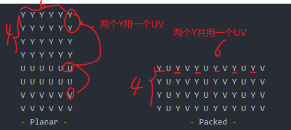
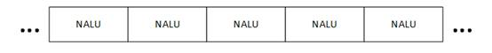

# NV12

要理解NV12，首先我们从 RGB开始：RGB三原色， 红绿蓝，分别用一个字节（8bit）来表达，范围是0-255，因此每个像素按照这种编码方式需要3个字节（24bit），即24位图

## YUV

RGB虽然好理解，但是占用空间大，在网络传输中肯定不适用，因此引入YUV表达方式。

Y U V ：亮度和色度。 色度又分为两个子维度：色调和饱和度。范围0-255

Y亮度，U色调，V饱和度。分别使用一个字节来存储信息，因此yuv也占3 个字节。

RGB和YUV之间有转换关系，很容易使用cuda实现：

```
Y = 0.257R + 0.504G + 0.098B + 16
U = 0.148R - 0.291G + 0.439B + 128
V = 0.439R - 0.368G - 0.071B + 1

B = 1.164(Y - 16) + 2.018(U - 128)
G = 1.164(Y - 16) - 0.813(V - 128) - 0.391(U - 128)
R = 1.164(Y - 16) + 1.596(V - 128)
```

若使用原始大小的YUV存储，实际上和RGB所占空间一致，但是有研究说明 人类对Y比UV敏感，因此真正使用中：一半保持Y的数量不变，同时减少UV的数量。比如几个像素共用一个UV。不同的共用方式就带来不同的编码方式：

        YUV 4:4:4   每一个Y对应一组UV分量 

        YUV 4:2:0   每四个Y共用一组UV分量

YUV的存储格式分为两种：

* packed  YUV分量穿插排列，三个分量存在i个Byte数组中。

* planar  YUV分量分别存储在三个Byte数组中。

## 

## NV12

NV12属于YUV420， 存储格式为Y信息存储在一个数组中，UV信息存储在一个矩阵中。

对于一个6*4的对象

```
Y Y Y Y Y Y      
Y Y Y Y Y Y      
Y Y Y Y Y Y      
Y Y Y Y Y Y     
U V U V U V     
U V U V U V
```

从排布格式中知道： <mark>nv12图像的存储空间中 W和原图一样，H则是原图的1.5倍</mark>。

NPP中有相关的转换函数：

`NppStatus nppiYUVToBGR_8u_C3R(const Npp8u * pSrc, int nSrcStep, Npp8u * pDst, int nDstStep, NppiSize oSizeROI)`

cuda实现：

```cpp
static __device__ uint8_t cast(float value){
     return value < 0 ? 0 : (value > 255 ? 255 : value);
}

static __global__ void convert_nv12_to_bgr_kernel(
    const uint8_t* y,        // y分量的起始地址
    const uint8_t* uv,      // UV分量的起始地址，与y分量起始地址相差w*h
    int width,              // 输出图的宽高
    int height, 
    int linesize,           // step 一般等于w
    uint8_t* dst_bgr,       //输出地址
    int edge               // edge是所有像素==w*h
){  
        /*
          实际上YUV所占用的内存空间是w*(1.5h)*sizeof(uchar) 
          输出yuv和输出rgb值范围都是0-255
        */ 
    int position = blockDim.x * blockIdx.x + threadIdx.x;
    if (position >= edge) return;

    int ox = position % width;    // 余数计算的是当前值在矩阵的第几列 范围是0-w
    int oy = position / width;    // 计算的是当前值矩阵的第几行
    const uint8_t& yvalue = y[oy * linesize + ox];  // y值
    /*
        U V U V U V 穿插存储。
        因为4个y共用一个uv，所以Y中的 0 1 行 对应uv的第0行
                             Y中的 2 3 行 对应uv的第1行
                             所以uv的行下标是 oy/2 ==> oy>>1
        对于列下标 Y中的 0 1 列 对应uv的0列
                  Y中的 2 3 列 对应uv的2列
                  Y中的 4 5 列 对应uv的4列
        转为2进制  0000 & 1110 --> 0000 --> 0
                  0001 & 1110 --> 0000 --> 0
                  0010 & 1110 --> 0010 --> 2
                  0011 & 1110 --> 0010 --> 2
          可以看到，因为前面的值每两次最后输出的值增加2（即2进制进一位）， 
          所以输出的二进制中，最后一位要始终为0，然后位与操作，这样就能实现。
    */
    int offset_uv = (oy >> 1) * linesize + (ox & 0xFFFFFFFE);
    const uint8_t& u = uv[offset_uv + 0];
    const uint8_t& v = uv[offset_uv + 1];

    //B =  1.164 * (Y - 16) +  2.018 * (U - 128);
    //G =  1.164 * (Y - 16) -  0.391 * (U - 128) - 0.813 * (V - 128);
    //R =  1.164 * (Y - 16) + 1.596 * (V - 128);

    dst_bgr[position * 3 + 0] = cast(1.164f * (yvalue - 16.0f) + 2.018f * (u - 128.0f));
    dst_bgr[position * 3 + 1] = cast(1.164f * (yvalue - 16.0f) - 0.813f * (v - 128.0f) - 0.391f * (u - 128.0f));
    dst_bgr[position * 3 + 2] = cast(1.164f * (yvalue - 16.0f) + 1.596f * (v - 128.0f));
    }


// 调用时
convert_nv12_to_bgr_invoke(
 image.device_data, image.device_data + image.width * image.height,
 image.width, image.height, image.width,
 image_device, preprocess_stream
);
```

## RGB、YUV像素数据处理
code: https://blog.csdn.net/leixiaohua1020/article/details/50534150

我们通过雷神的博客以及代码来更深入理解RGB和YUV的相关知识。

1. 从例子1中，我们不要对YUV太过害怕，和RGB对比，就是内存数据排布方式不同，可以用c的IO方式直接读取。
2. 例子3中，灰度化图像，只需要将U、V分量设置成128即可。我们将彩色图变为灰度图，其实只要将UV色度分量的值置为0值就可以了，但是置为0值并不是直接赋值为0。因为U、V色度分量在存储时，经过了偏移处理，偏移处理前，UV的取值范围是-128~127，这时候的无色UV的值就是0。但是经过偏移后，原本的值范围从-128~127变为了0~255，那么这时，将UV分量的值赋值为128，就相当于偏移前的无色值了
3. 亮度减半，就是将Y分量的值减半。

## H.264视频码流解析
从H.264码流中分析得到它的基本单元NALU，并且可以简单解析NALU首部的字段

code: https://blog.csdn.net/leixiaohua1020/article/details/50534369

1. H.264原始码流（又称为“裸流”）是由一个一个的NALU组成的


    每个NALU之间通过startcode（起始码）进行分隔，起始码分成两种：0x000001（3Byte）或者0x00000001（4Byte）。如果NALU对应的Slice为一帧的开始就用0x00000001，否则就用0x000001。

    H.264码流解析的步骤就是首先从码流中搜索0x000001和0x00000001，分离出NALU；然后再分析NALU的各个字段。

2. 


## opengl
1. https://www.cnblogs.com/joyeecheung/p/4310487.html

2. https://glew.sourceforge.net/index.html
