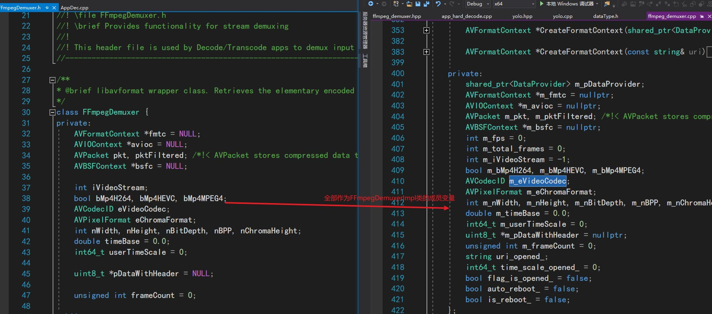
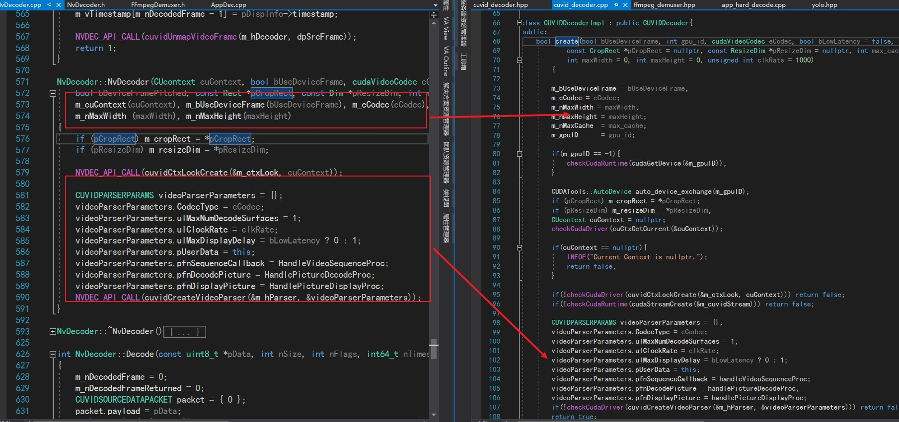
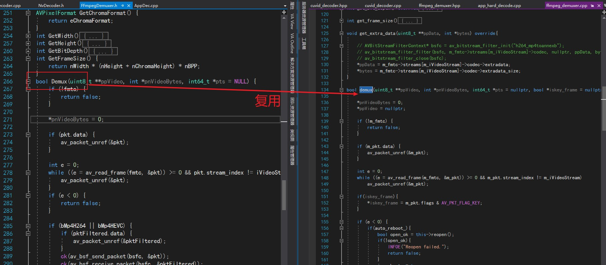
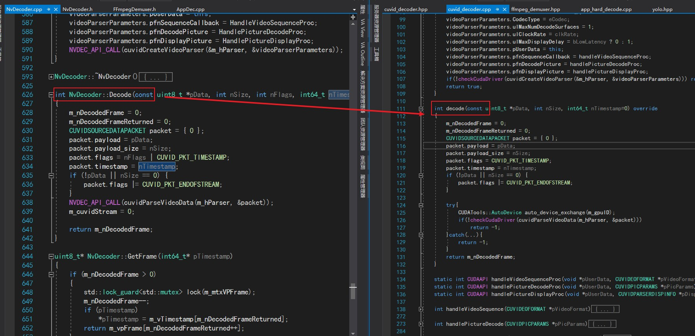
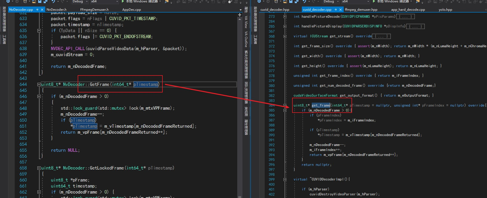

# NVDECODE

对于杜佬封装的库，[ffhdd](https://github.com/BaofengZan/hard_decode_trt-windows/tree/main/src/ffhdd) 我一直很好奇，杜佬是如何想到这样的。因此我们设身处地来想一下，我们要使用NVDecode，因此我们就从这个NV库开始。

在V4的文件中，我们已经简单介绍了nvdec的整体流程：Demuxer, Video Parser, and Video Decoder

首先我们下载到NvCodec的API后，在文件下下有个sample文件夹，我们仅仅看解码部分[Samples\AppDecode\AppDec\AppDec.cpp]

整体流程很简单： 创建cucontext-->打开文件--> 创建解复用器 --> 创建解码器  -->  解复用 --> 解码 --> 拿结果

### 1. 创建解复用器

```cpp
// sample代码
FFmpegDemuxer demuxer(szInFilePath);

// 封装代码  app_hard_decode.cpp中
auto demuxer = FFHDDemuxer::create_ffmpeg_demuxer("exp/fall_video.mp4");
```

这里FFmpegDemuxer类[ Samples\Utils\FFmpegDemuxer.h ] 是libavformat 包装类。在这个类中，对解复用实例进行了创建，但是这里的代码实现全部在头文件中，因此杜佬对其做了封装，使用了IMPL 接口与实现分离。 


具体的实现则放在了FFmpegDemuxerImpl类中，最外层则调用creat函数创建父类的指针。



然后在FFmpegDemuxerImpl中的open函数，实际上就是原始sample中的构造函数中的代码。

### 2. 创建解码器

```cpp
// sample代码
NvDecoder dec(cuContext, false, FFmpeg2NvCodecId(demuxer.GetVideoCodec()), false, false, &cropRect, &resizeDim);
//封装代码
auto decoder = FFHDDecoder::create_cuvid_decoder(
        false, FFHDDecoder::ffmpeg2NvCodecId(demuxer->get_video_codec()), -1, 0
    );
```

这里FFmpeg2NvCodecId函数直接复用。

sample代码的NvDecoder调用的是[Samples\NvCodec\NvDecoder\NvDecoder.h],  这里也是把所有代码暴露了出来，杜佬也进行了封装。

封装后的create_cuvid_decoder函数创建了CUVIDDecoderImpl实例，并调用了create函数，这里create函数实现就是原始sample的NvDecoder构造函数。



### 3. 解复用

```cpp
 //sample
 demuxer.Demux(&pVideo, &nVideoBytes);

 //封装
 demuxer->demux(&packet_data, &packet_size, &pts);
```



### 4. 解码

```cpp
// sample
nFrameReturned = dec.Decode(pVideo, nVideoBytes);
//封装
int ndecoded_frame = decoder->decode(packet_data, 
                                    packet_size, 
                                    pts);
```



### 5. 拿结果

```cpp
// sample
 pFrame = dec.GetFrame();
// 封装
decoder->get_frame(&pts, &frame_index) 
```



至此就完成了ffhdd的封装，但是这几个函数返回值的意义，我目前还在学习。后面会更新。
