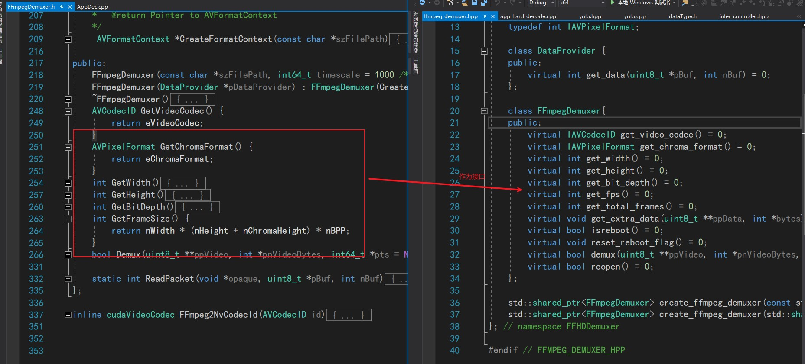
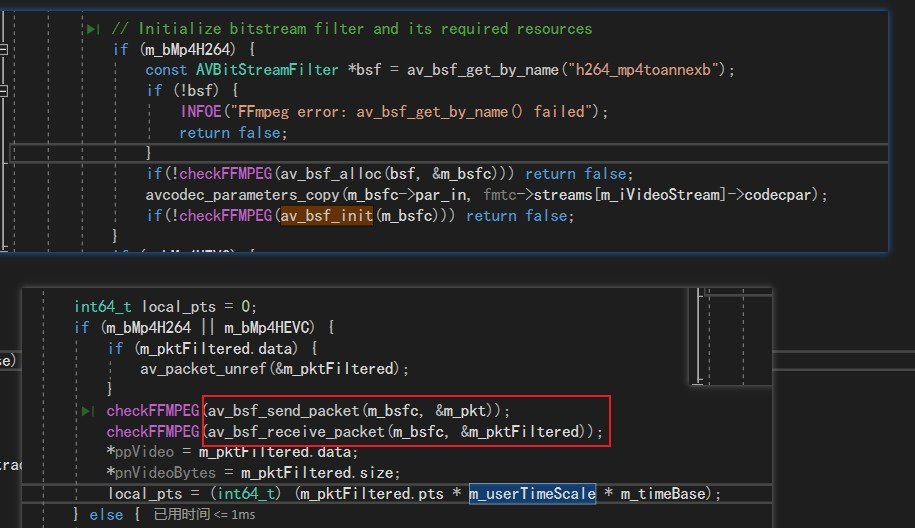

# NVDECODE

对于杜佬封装的库，[ffhdd](https://github.com/BaofengZan/hard_decode_trt-windows/tree/main/src/ffhdd) 我一直很好奇，杜佬是如何想到这样的。因此我们设身处地来想一下，我们要使用NVDecode，因此我们就从这个NV库开始。

在V4的文件中，我们已经简单介绍了nvdec的整体流程：Demuxer, Video Parser, and Video Decoder

首先我们下载到NvCodec的API后，在文件下下有个sample文件夹，我们仅仅看解码部分[Samples\AppDecode\AppDec\AppDec.cpp]

整体流程很简单： 创建cucontext-->打开文件--> 创建解复用器 --> 创建解码器  -->  解复用 --> 解码 --> 拿结果

### 1. 创建解复用器

```cpp
// sample代码
FFmpegDemuxer demuxer(szInFilePath);

// 封装代码  app_hard_decode.cpp中
auto demuxer = FFHDDemuxer::create_ffmpeg_demuxer("exp/fall_video.mp4");
```

这里FFmpegDemuxer类[ Samples\Utils\FFmpegDemuxer.h ] 是libavformat 包装类。在这个类中，对解复用实例进行了创建，但是这里的代码实现全部在头文件中，因此杜佬对其做了封装，使用了IMPL 接口与实现分离。 



具体的实现则放在了FFmpegDemuxerImpl类中，最外层则调用creat函数创建父类的指针。


然后在FFmpegDemuxerImpl中的open函数，实际上就是原始sample中的构造函数中的代码。

### 2. 创建解码器

```cpp
// sample代码
NvDecoder dec(cuContext, false, FFmpeg2NvCodecId(demuxer.GetVideoCodec()), false, false, &cropRect, &resizeDim);
//封装代码
auto decoder = FFHDDecoder::create_cuvid_decoder(
        false, FFHDDecoder::ffmpeg2NvCodecId(demuxer->get_video_codec()), -1, 0
    );
```

这里FFmpeg2NvCodecId函数直接复用。

sample代码的NvDecoder调用的是[Samples\NvCodec\NvDecoder\NvDecoder.h],  这里也是把所有代码暴露了出来，杜佬也进行了封装。

封装后的create_cuvid_decoder函数创建了CUVIDDecoderImpl实例，并调用了create函数，这里create函数实现就是原始sample的NvDecoder构造函数。


### 3. 解复用

```cpp
 //sample
 demuxer.Demux(&pVideo, &nVideoBytes);

 //封装
 demuxer->demux(&packet_data, &packet_size, &pts);
```


### 4. 解码

```cpp
// sample
nFrameReturned = dec.Decode(pVideo, nVideoBytes);
//封装
int ndecoded_frame = decoder->decode(packet_data, 
                                    packet_size, 
                                    pts);
```


### 5. 拿结果

```cpp
// sample
 pFrame = dec.GetFrame();
// 封装
decoder->get_frame(&pts, &frame_index) 
```


至此就完成了ffhdd的封装，但是这几个函数返回值的意义，我目前还在学习。后面会更新。


## 代码解析

1 在创建demux实例中，有个open函数，里面对文件的读取等做了初始化

* CreateFormatContext 调用了avformat_open_input，返回AVFormatContext（fmtc）
  
  * 用于打开多媒体数据并且获得一些相关的信息。
  
  * int avformat_open_input(AVFormatContext **ps, const char *filename, AVInputFormat *fmt, AVDictionary **options);
    
    * ps：函数调用成功之后处理过的AVFormatContext结构体。
    
    * file：打开的视音频流的URL。
    
    * fmt：强制指定AVFormatContext中AVInputFormat的。这个参数一般情况下可以设置为NULL，这样FFmpeg可以自动检测AVInputFormat
    
    * dictionay：附加的一些选项，一般情况下可以设置为NULL。
    
    * 函数执行成功的话，其返回值大于等于0。

* avformat_find_stream_info(fmtc, nullptr)
  
  * 读取一部分视/音频数据并且获得一些相关的信息。FFmpeg在调用avformat_open_input()之后，可能码流信息不够完整，可以使用avformat_find_stream_info()获取更多的码流信息。比如获取视频帧率、视频宽高，重新计算最大分析时长，打开解码器解码获取codec数据
  
  * int avformat_find_stream_info(AVFormatContext *ic, AVDictionary **options);
    
    * ic：输入的AVFormatContext。
    
    * options：额外的选项 一般给nullptr
    
    * 函数正常执行后返回值大于等于0

* m_iVideoStream = av_find_best_stream(fmtc, AVMEDIA_TYPE_VIDEO, -1, -1, nullptr,0);
  
  * int av_find_best_stream(AVFormatContext *ic,
                            enum AVMediaType type,
                            int wanted_stream_nb,
                            int related_stream,
                            AVCodec **decoder_ret,
                            int flags);
    
    * 返回的是int值，就是返回音视频的索引值
    
    * ic是AVFormatContext，从avformat_open_input中得来
    
    * type是AVMediaType 。视频流就是AVMEDIA_TYPE_VIDEO

* <mark>这两个函数调用完后，fmtc里面的stream及AVCodecParameters *codecpar都有了值</mark>

2 在demux函数中，用到了ffmpeg的若干函数

* (e = av_read_frame(m_fmtc, &m_pkt)）
  
  * av_read_frame()的作用是读取码流中的音频若干帧或者视频一帧。解码视频时，每解码一个视频帧，需要先调用av_read_frame()获得一帧视频的压缩数据，然后才能对该数据进行解码（比如h.264一帧压缩数据通常对应一个NAL）
  
  * int av_read_frame(AVFormatContext *s, AVPacket *pkt);
    
    * AVFormatContext 文件格式上下文
    
    * AVPacket *pkt 这个值不能为nullptr，必须是一个空间，
    
    * 返回值：return 0 is OK, <0 on error or end of file。如果是错误，pkt将会为空
    
    * AVPacket *pkt 为读取视频流得到的数据包，返回的数据包被引用计数，并且永久有效。如果不再需要该packet包，必须使用av_packet_unref()进行释放

* av_bsf_send_packet(m_bsfc, &m_pkt)
  
  * av_bsf_send_packet 的作用是把传过来的 AVPacket 放到指定的 AVBSFContext 内部，并将该 AVPacket 置为空。
    
    * bsf-->Bitstream Filter . h264有两种封装形式（1）annexb模式，传统模式，有startcode（0x000001或0x0000001）分割NALU （2）AVCC模式，一般用mp4、mkv、flv容器封装，以长度信息分割NALU
    
    * 为了进行这两个封装形式的转换，ffmpeg提供了h264_mp4toannexb的Bitstream Filter(bsf)来实现。

* ```cpp
  Bitstream Filter
  
  （1）主要目的是对数据进行格式转换，使它能够被解码器处理（比如HEVC QSV的解码器）。
  
  （2）Bitstream Filter对已编码的码流进行操作，不涉及解码过程。
  
  （3）使用ffmpeg -bsfs命令可以查看ffmpeg工具支持的Bitstream Filter类型。
  
  （4）使用ff*工具的 -bsf 选项来指定对具体流的Bitstream Filter，使用逗号分割的多个filter，如果filter有参数， 参数名和参数值跟在filter名称后面。
  
  bsf的使用方法：
  
  （1）使用查询函数av_bsf_get_by_name 根据名称查找对应的AVBitstreamFilter。
  
  （2）使用av_bsf_alloc为AVBSFContext和他的一些内部变量分配内存。
  
  （3）设置AVBSFContext可能需要使用一些变解码参数和time_base[2].
  
  （4）在设置好参数之后使用av_bsf_init来初始化bsf.
  
  （5）使用av_bsf_send_packet函数输入数据，并使用av_bsf_receive_packet获得处理后的输出数据。
  
  （6）处理结束后，av_bsf_free清理用于上下文和内部缓冲区的内存。
  ```



3 decode函数

* 调用了cuvidParseVideoData(m_hParser, &packet)，实现解码

4 几个结构体

* [ FFMPEG结构体分析](https://blog.csdn.net/leixiaohua1020/article/details/14214705)

* [ffmpeg结构之AVFormatContext及其相关函数](https://blog.csdn.net/yangguoyu8023/article/details/107470119?ops_request_misc=%257B%2522request%255Fid%2522%253A%2522166429005216800182797885%2522%252C%2522scm%2522%253A%252220140713.130102334.pc%255Fblog.%2522%257D&request_id=166429005216800182797885&biz_id=0&utm_medium=distribute.pc_search_result.none-task-blog-2~blog~first_rank_ecpm_v1~rank_v31_ecpm-7-107470119-null-null.nonecase&utm_term=ffmpeg&spm=1018.2226.3001.4450)

* [ffmpeg结构体之AVCodecParameters及其相关函数](https://blog.csdn.net/yangguoyu8023/article/details/107545229)

* [ffmpeg结构体之AVStream及其相关函数](https://blog.csdn.net/yangguoyu8023/article/details/107545065?ops_request_misc=%257B%2522request%255Fid%2522%253A%2522166429005216800182797885%2522%252C%2522scm%2522%253A%252220140713.130102334.pc%255Fblog.%2522%257D&request_id=166429005216800182797885&biz_id=0&utm_medium=distribute.pc_search_result.none-task-blog-2~blog~first_rank_ecpm_v1~rank_v31_ecpm-3-107545065-null-null.nonecase&utm_term=ffmpeg&spm=1018.2226.3001.4450)

* [ffmpeg结构体之AVPacket及其相关函数](https://blog.csdn.net/yangguoyu8023/article/details/107496770?ops_request_misc=%257B%2522request%255Fid%2522%253A%2522166429017516782388060109%2522%252C%2522scm%2522%253A%252220140713.130102334.pc%255Fblog.%2522%257D&request_id=166429017516782388060109&biz_id=0&utm_medium=distribute.pc_search_result.none-task-blog-2~blog~first_rank_ecpm_v1~rank_v31_ecpm-1-107496770-null-null.nonecase&utm_term=AVPacket&spm=1018.2226.3001.4450)

* 

```tex
(1)AVFormatContext
(2)AVStream
(3)AVCodecParameters
(4)AVPacket
```

5 使用nvDecode API开始解码

* 首先在createdecoder实例时，调用了cuvidCreateVideoParser(&m_hParser, &videoParserParameters)函数。
  
  * 该接口是用来创建video parser，主要参数是设置三个回调函数，实现对解析出来的数据的处理

* cuvidParseVideoData(m_hParser, &packet) : 该接口是用来向parser塞数据，通过不断地塞h.264数据，parser会通过回调接口对解析出来的数据进行处理。
  
  * 从 pPacket 中的源数据包中解析视频数据
  
  * 从 pPacket 中提取参数集，如 SPS、PPS、比特流等
  
  * 使用 CUVIDPICPARAMS 数据回调 pfnDecodePicture 以启动硬件解码
  
  * 使用 CUVIDEOFORMAT 数据回调 pfnSequenceCallback 以获取初始序列头或当解码器遇到视频格式更改时回调 pfnDisplayPicture 使用 CUVIDPARSERDISPINFO 数据以显示视频帧

* ```c
  static int CUDAAPI 
  handleVideoSequenceProc(void *pUserData, 
                          CUVIDEOFORMAT *pVideoFormat) {
   return ((CUVIDDecoderImpl *)pUserData)->handleVideoSequence(pVideoFormat); 
  }
  static int CUDAAPI handlePictureDecodeProc(void *pUserData, 
  CUVIDPICPARAMS *pPicParams) { 
  return ((CUVIDDecoderImpl *)pUserData)->handlePictureDecode(pPicParams); 
  }
  static int CUDAAPI handlePictureDisplayProc(void *pUserData, CUVIDPARSERDISPINFO *pDispInfo) { return ((CUVIDDecoderImpl *)pUserData)->handlePictureDisplay(pDispInfo); }
  ```
  
  * `HandlePictureDecode` 应该是在成功解析到数据帧的时候调用，这个函数调用了 `cuvidDecodePicture` 解码数据。
  
  * 数据解码出来之后会调用 `HandlePictureDisplay` 函数，该函数把数据放入到数据缓冲区 `FrameQueue` 中以便编码器能够把数据取出来。
